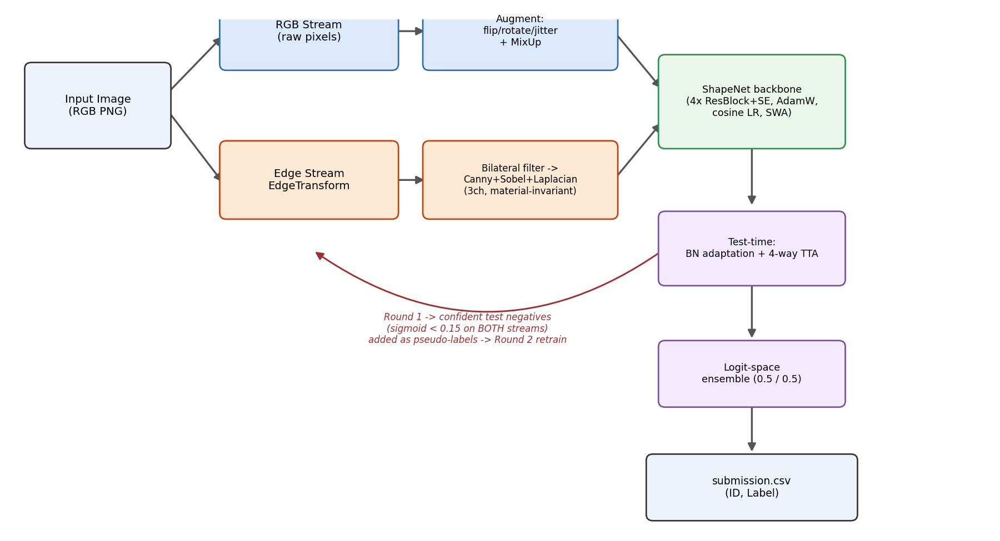
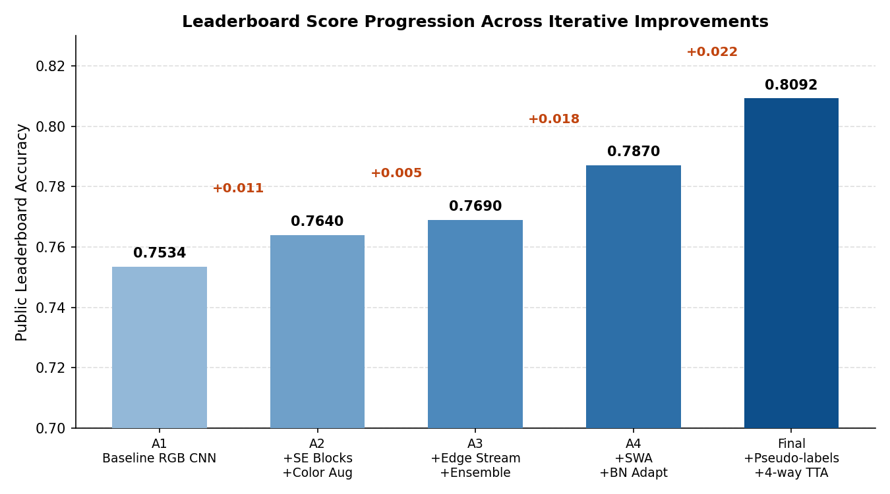

# Dual-Stream Synthetic Scene Classifier

Binary image classification on synthetic, ray-traced 3D scenes, trained entirely **from scratch** (no pre-trained weights) using a dual-stream CNN that combines raw RGB pixels with a custom material-invariant edge representation.

Built for the **IITH Deep Learning 2026 Hackathon** ([Kaggle competition](https://www.kaggle.com/competitions/iith-deep-learning-2026-hackathon)), part of the CS5480: Deep Learning course at IIT Hyderabad.

**Public leaderboard accuracy: 0.8092** (0.809226) — up from a 0.7534 single-stream baseline.

<p align="center">
  
</p>

## Problem

Each scene contains objects (cube, sphere, cylinder) varying in material (rubber/matte vs. metal/specular), size, color, and position, with **no canonical orientation**. Every image gets a binary label (0/1), and the rule that generates the label is **latent** — never disclosed, and must be inferred purely from the training data. A strict competition rule prohibits any pre-trained weights: everything here is trained from scratch.

| Split | Details | Images |
|---|---|---|
| Train — class 0 | `train/0/` | 9,000 |
| Train — class 1 | `train/1/` | 9,000 |
| Test (public + private) | `test/` (labels hidden) | 5,010 |

The central difficulty is that a model can reach ~100% validation accuracy by latching onto *any* attribute correlated with the label in the training split — color, material reflectance, lighting — without learning the true generating rule. That gap between validation and leaderboard score is the whole game; see [Results](#results) below.

## Approach

A **dual-stream** design, so the model can't fully rely on one shortcut:

- **RGB stream** — raw pixels, heavy color/geometric augmentation (`ColorJitter`, `RandomGrayscale`, `GaussianBlur`, `RandomErasing`) + MixUp, so it can still exploit genuine color/appearance signal if present.
- **Edge stream** — a custom [`EdgeTransform`](src/scene_classifier/edge_transform.py): bilateral filter (suppresses specular highlights from metallic objects) → Canny edges + Sobel gradient magnitude + Laplacian, stacked into a 3-channel, material-invariant geometry map.

Both streams share the same backbone, **ShapeNet** ([`src/scene_classifier/model.py`](src/scene_classifier/model.py)): a compact 4-stage encoder of `ResBlock → SEBlock → strided conv`, global average pooling, and a dropout MLP head — trained with `AdamW`, cosine LR annealing, and Stochastic Weight Averaging (SWA) over the final epochs.

At inference:
1. **BatchNorm test-time adaptation** — reset and re-estimate BN running stats on the unlabeled test set, to correct for train/test distribution shift.
2. **4-way deterministic TTA** — average logits over identity, horizontal-flip, vertical-flip, and both-flip views (scenes have no canonical orientation).
3. **Two-round self-training** — Round 1 models score the test set; images where *both* streams predict `sigmoid < 0.15` are added as conservative negative-only pseudo-labels; both streams are retrained from scratch on the expanded set for Round 2.
4. **Equal-weight ensemble** — final prediction is `0.5 * rgb_logit + 0.5 * edge_logit`, thresholded at 0.

## Results

Each stage of the pipeline was added iteratively, and each produced a measurable leaderboard gain:

<p align="center">
  
</p>

| Approach | Key additions | Public LB score |
|---|---|---|
| A1 | Baseline RGB CNN (CrossEntropy, 8-way TTA) | 0.7534 |
| A2 | + SE blocks + stronger color augmentation | ≈0.764 |
| A3 | + Edge stream + dual-stream ensemble + BCE | ≈0.769 |
| A4 | + SWA + BN test-time adaptation | ≈0.787 |
| **Final** | + Pseudo-labeling (round 2) + 4-way deterministic TTA | **0.8092** |

Both streams individually reach ≈100% validation accuracy (stratified 85/15 split) but only 0.8092 on the leaderboard — a ≈19-point gap that's the clearest evidence the models are partly exploiting spurious, training-distribution-specific correlations rather than the one true rule. The edge stream and self-training loop close part of that gap by removing appearance shortcuts and injecting signal from the test distribution itself, but don't eliminate it. See the [full report](reports/team_48_report.pdf) for the detailed writeup and analysis.

## Repository Structure

```
.
├── src/scene_classifier/       # Installable package: the refactored pipeline
│   ├── model.py                #   ResBlock, SEBlock, ShapeNet backbone
│   ├── edge_transform.py       #   EdgeTransform (bilateral filter + Canny/Sobel/Laplacian)
│   ├── data.py                 #   Dataset classes + path loading helpers
│   ├── augment.py              #   Train/eval transforms, MixUp
│   ├── train.py                #   train_one_model (SWA, cosine LR) + adapt_bn
│   ├── inference.py            #   predict_with_tta, pseudo-label selection
│   └── pipeline.py             #   End-to-end orchestration + CLI entry point
├── tests/                      # Smoke tests for model/transform shapes (pytest)
├── notebooks/                  # Original Kaggle submission notebook (unmodified, for provenance)
├── reports/                    # Full written report (methodology, ablations, team contributions)
├── submissions/                # Final submission.csv
└── assets/                     # README diagrams
```

The `notebooks/` folder holds the exact notebook that produced the competition submission. The `src/scene_classifier` package is a from-scratch refactor of that same logic into a modular, testable, pip-installable form — the code is equivalent, but the notebook is preserved untouched as the historical record of what was actually run on Kaggle.

## Usage

```bash
pip install -r requirements.txt
pip install -e .
```

Expected dataset layout:

```
dataset_root/
├── train/
│   ├── 0/*.png
│   └── 1/*.png
└── test/*.png
```

Run the full two-round training + inference pipeline:

```bash
python -m scene_classifier.pipeline --data-dir /path/to/dataset_root --output submission.csv
```

Run the test suite (no dataset required — shape/contract checks only):

```bash
pytest tests/
```

## Key Design Decisions

| Decision | Why |
|---|---|
| No pre-trained weights | Competition rule; ImageNet priors don't transfer well to this synthetic render domain anyway |
| Edge stream (bilateral filter → Canny/Sobel/Laplacian) | Material-invariant geometry signal; suppresses specular artifacts from metallic objects |
| SWA + BN test-time adaptation | Flatter loss minima (SWA) combined with re-calibrated BatchNorm stats on the test distribution — together account for ≈1.6pp of the gain |
| Pseudo-labels, negatives only | Expands the training pool from the test set conservatively; a false positive pseudo-label would inflate the positive rate and directly hurt accuracy, so only high-confidence, dual-model-agreed negatives are used |
| 4-way deterministic TTA (not 8-way with rotations) | Rotations introduced ambiguous spatial relationships in edge maps; flips alone were simpler, fully deterministic, and empirically stronger |
| Equal-weight (0.5/0.5) logit ensemble | RGB and edge streams make largely uncorrelated errors; no held-out set was reserved to tune ensemble weights |

## Related Work

Another team in the same competition ([Akshaybagde12/IIT-H-Deep-Learning-2026-Hackathon](https://github.com/Akshaybagde12/IIT-H-Deep-Learning-2026-Hackathon), 3rd/74, public LB 0.8135) independently arrived at the same dual-stream RGB + gradient-feature design, and additionally reported explicitly identifying the latent rule as **cube-and-sphere co-occurrence** (label 1 iff a scene contains both a cube and a sphere). That's a strong pointer for closing the remaining gap here — see [Future Work](reports/team_48_report.pdf) in the report for other directions considered (attribute probing, invariant risk minimization, object-centric representations).

## Team

Built for CS5480: Deep Learning, IIT Hyderabad — Team 48:

- Aayush Ranjan — RGB model pipeline, augmentation strategy, MixUp
- Ankit Kumar Sinha — Ensemble & inference pipeline, TTA, BN adaptation, pseudo-labeling
- Mayank Mishra — ShapeNet architecture, edge feature pipeline, dataset utilities

## License

[MIT](LICENSE)
